

    

<h1 align="center" style="margin: 20px 30px 0px 30px; font-weight: bold;">XiaoShiLiu</h1>

---

    <b>基于 Express + Vue 前后端分离仿小红书项目</b>

<a href="https://github.com/ZTMYO/XiaoShiLiu">简体中文</a>|<a href="doc/i18n/README_En.md">English</a>|<a href="doc/i18n/README_zh-Hant.md">繁體中文</a>

    
    
    
    

    
    
    </a>

> **声明**  
> 本项目基于 [GPLv3 协议](./LICENSE)，免费开源，仅供学习交流，禁止转卖，谨防受骗。如需商用请保留版权信息，确保合法合规使用，运营风险自负，与作者无关。

---

> 📁 **项目结构说明**：本项目包含完整的前后端代码，前端位于 `vue3-project/` 目录，后端位于 `express-project/` 目录。详细结构请查看 [项目结构文档](./doc/PROJECT_STRUCTURE.md)。

## 项目展示

### PC端界面

<table>
  <tr>
    <td>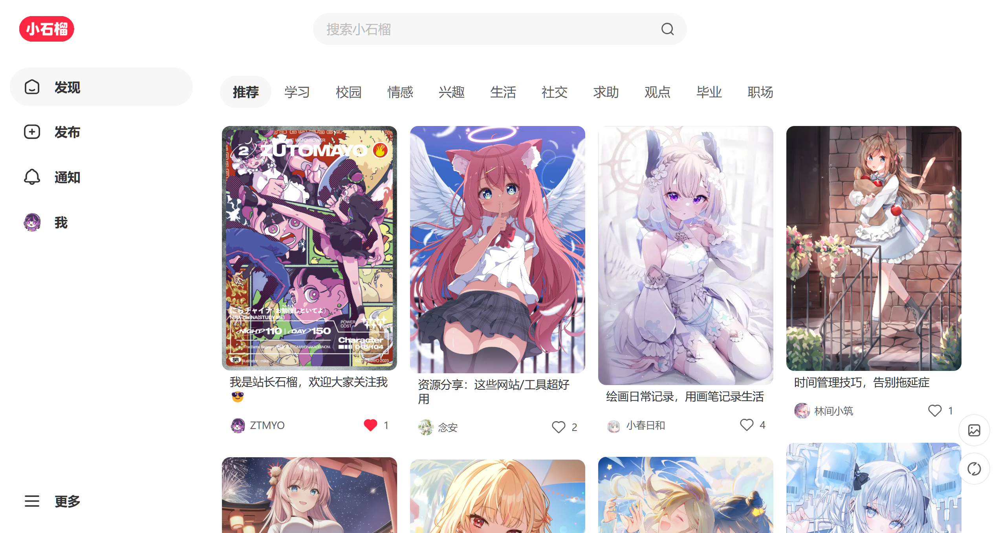</td>
    <td>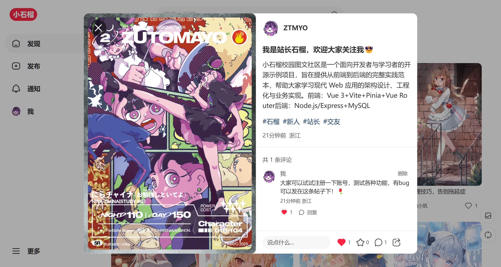</td>
    <td>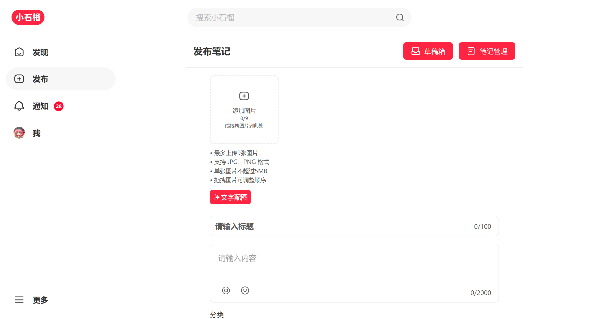</td>
  </tr>
  <tr>
    <td>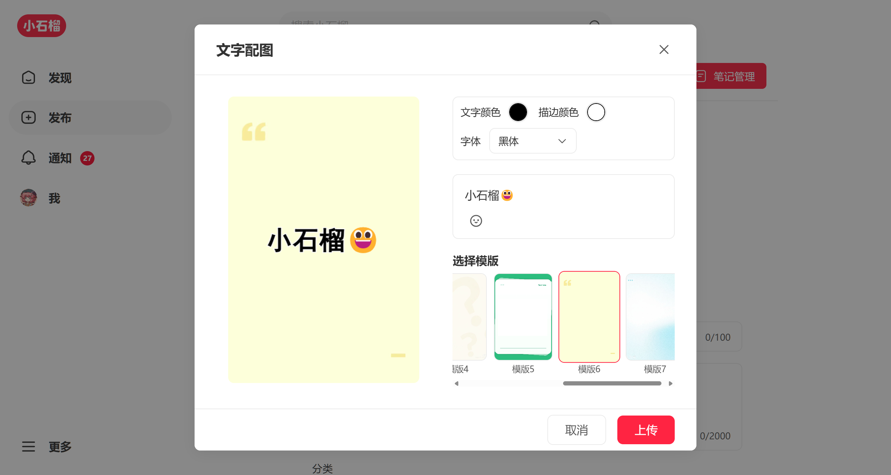</td>
    <td>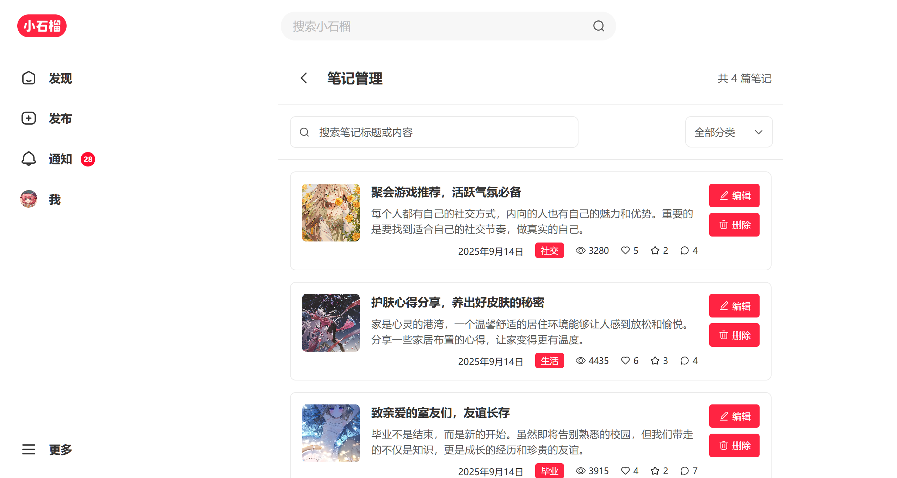</td>
    <td>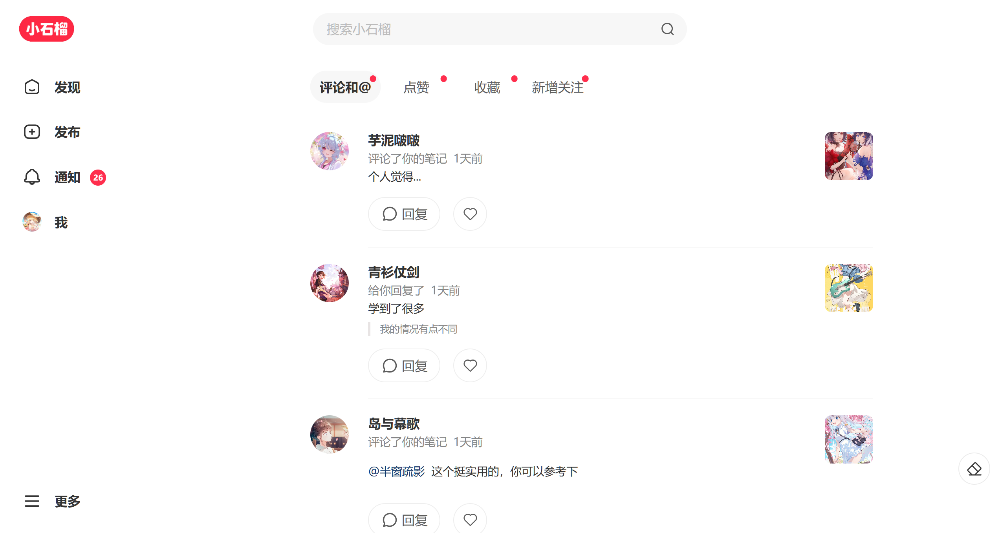</td>
  </tr>
  <tr>
    <td>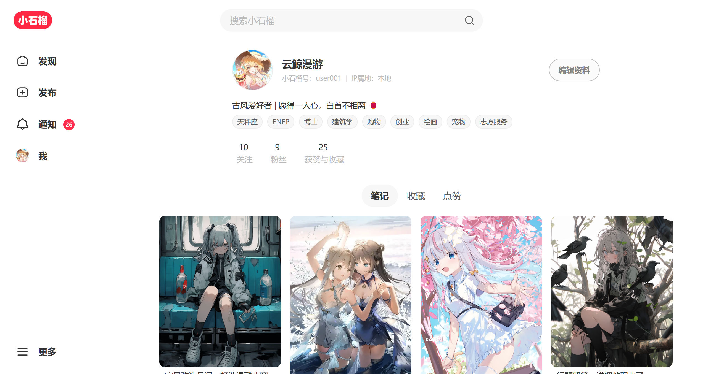</td>
    <td>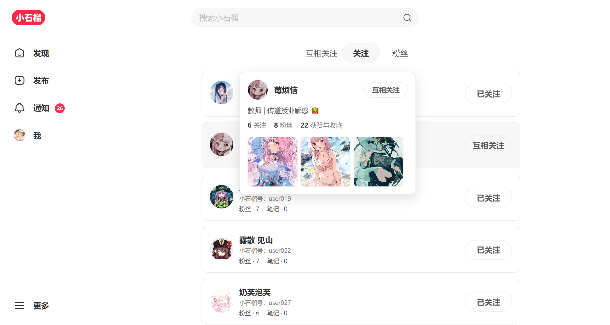</td>
    <td>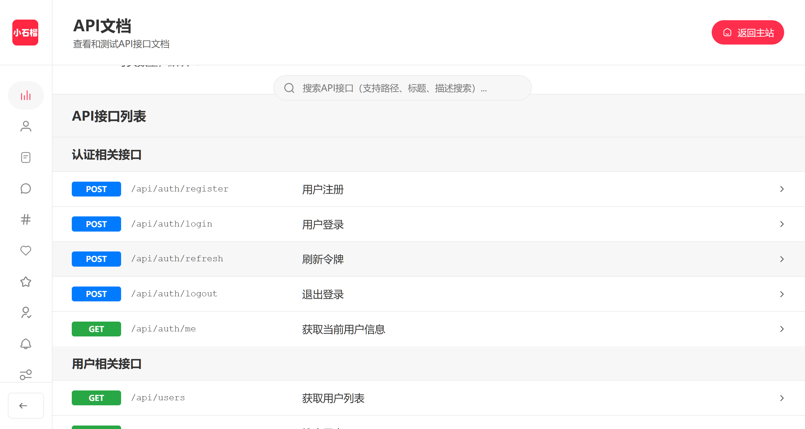</td>
  </tr>
  <tr>
    <td>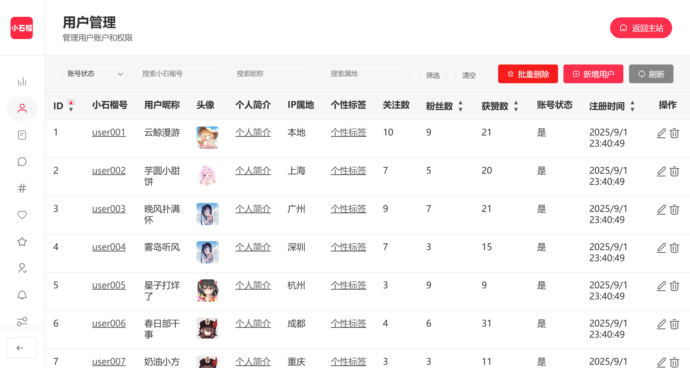</td>
    <td>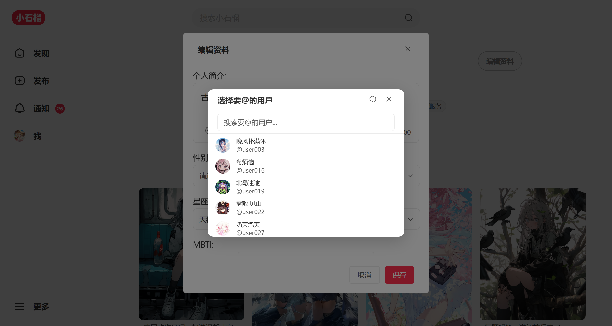</td>
    <td>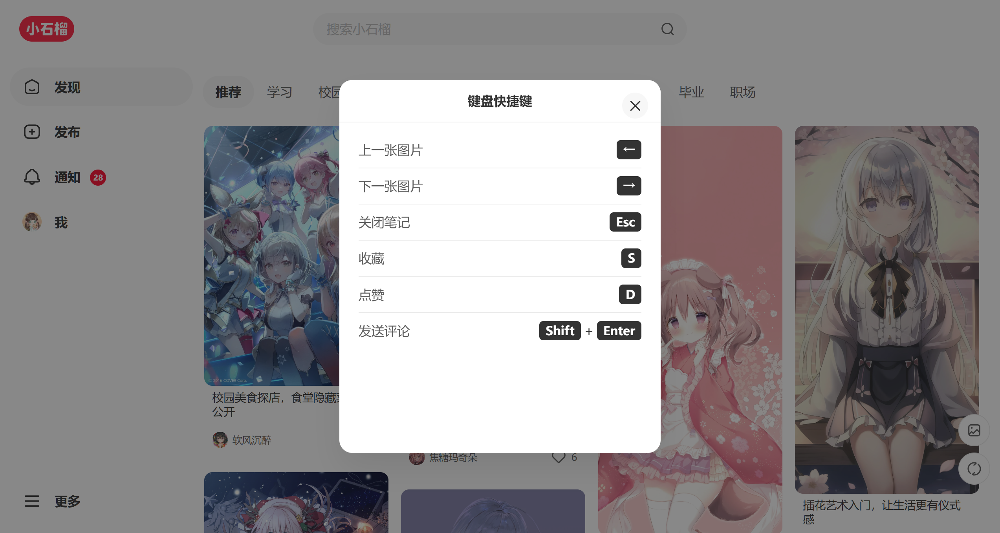</td>
  </tr>
  <tr>
    <td>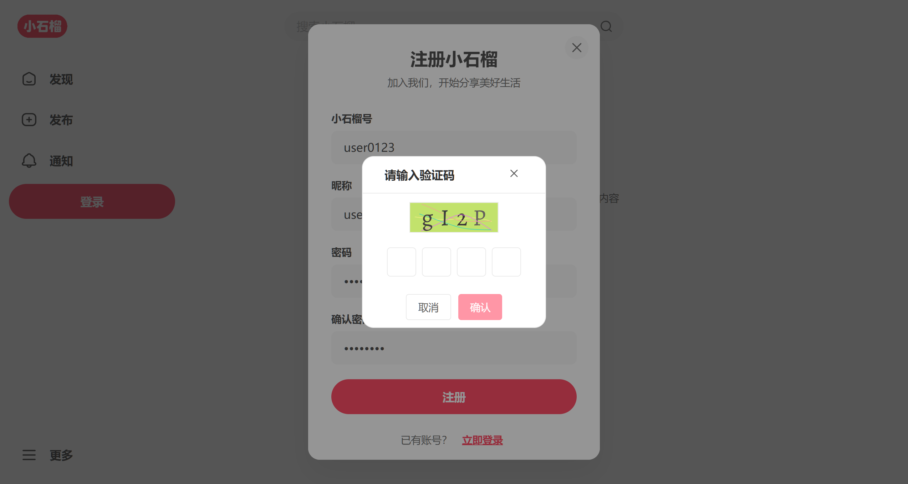</td>
    <td>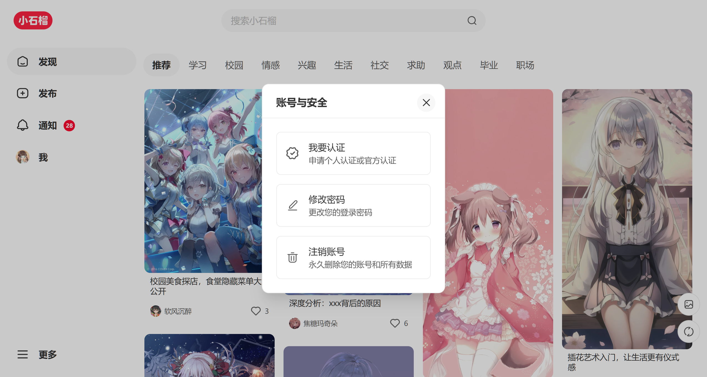</td>
    <td>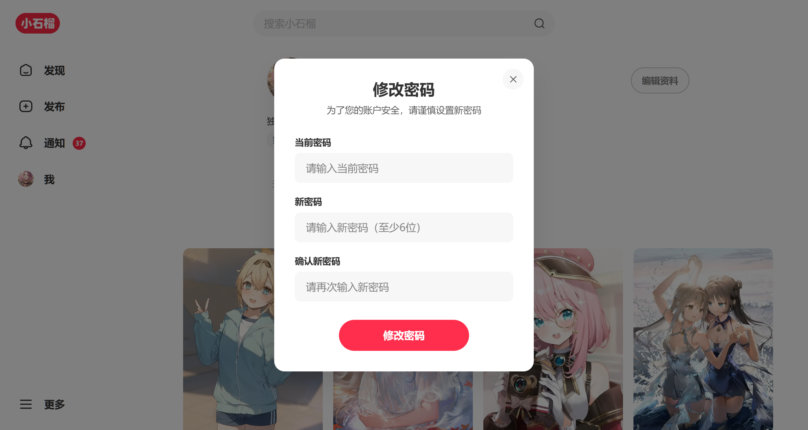</td>
  </tr>
    <tr>
    <td>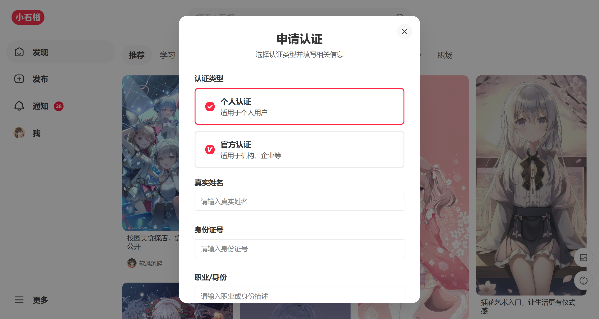</td>
    <td>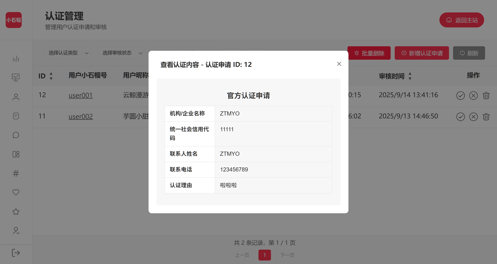</td>
    <td>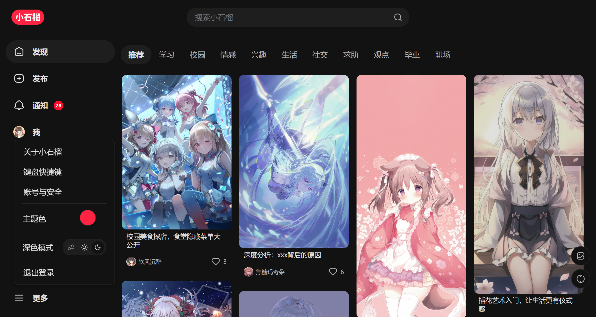</td>
  </tr>
</table>

## 项目文档

| 文档 | 说明 |
|------|------|
| [部署指南](./doc/DEPLOYMENT.md) | 部署配置和环境搭建说明 |
| [项目结构](./doc/PROJECT_STRUCTURE.md) | 项目目录结构架构说明 |
| [数据库设计](./doc/DATABASE_DESIGN.md) | 数据库表结构设计文档 |
| [API接口文档](./doc/API_DOCS.md) | 后端API接口说明和示例 |

## 项目亮点

- **工程化：** 环境配置、代码规范、构建与产物优化的完整流程
- **业务能力：** 鉴权流程、路由守卫、状态管理与接口封装
- **体验优化：** 骨架屏、懒加载、预加载、无障碍与响应式适配
- **组件与分层：** 可复用组件拆分、按领域分组与别名引入
- **后台管理：** 基础CRUD、数据管理与配置面板，支持后续扩展权限与统计
- **快速部署：** 基于 Docker 的一键部署方案，支持多环境配置与自动化部署

## 技术栈

> 💡点击可展开查看详细内容

<b>前端技术</b>

- **Vue.js 3** - 前端框架（Composition API）
- **Vue Router 4** - 路由管理
- **Pinia** - 状态管理
- **Vite** - 构建工具和开发服务器
- **Axios** - HTTP客户端
- **VueUse** - Vue组合式工具库
- **CropperJS** - 图片裁剪
- **Vue3 Emoji Picker** - 表情选择器
- **svg-captcha** - 验证码生成器

